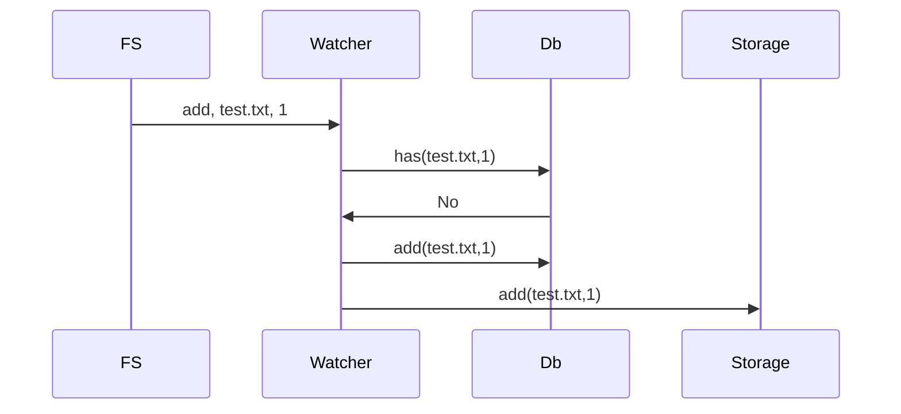

# Add file to the repository

`Add` file to the repository

```mermaid


sequenceDiagram;
    FS->>Watcher: add, test.txt, 1
    Watcher->>Db: has(test.txt,1)
    Db->>Watcher: No
    Watcher->>Db: add(test.txt,1)
    Watcher->>Storage: add(test.txt,1)

```

# Get a file from the repository

Add file to the repository

```mermaid


sequenceDiagram;
    FS->>Watcher: add, test.txt, 1
    Watcher->>Db: has(test.txt,1)
    Db->>Watcher: No
    Watcher->>Db: add(test.txt,1)
    Watcher->>Storage: add(test.txt,1)

```
