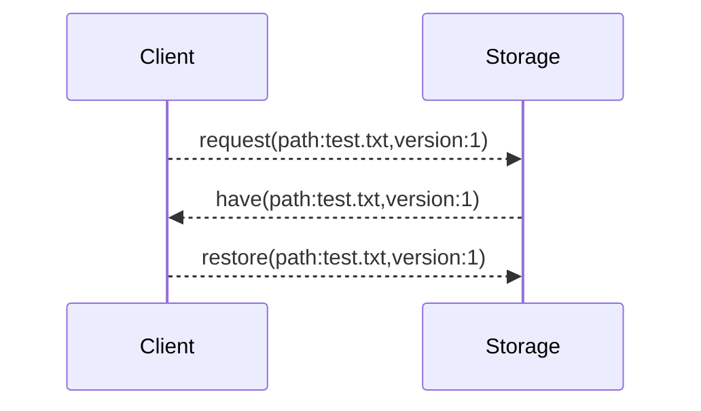

# Storage Network

```mermaid
sequenceDiagram;
  Client-->>Storage: request(path:test.txt,version:1)
  Storage-->>Client: have(path:test.txt,version:1)
  Client-->>Storage: restore(path:test.txt,version:1)
```
